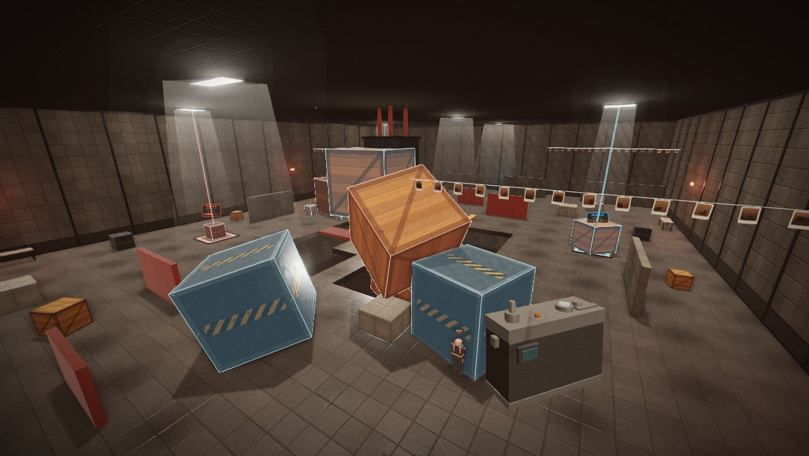
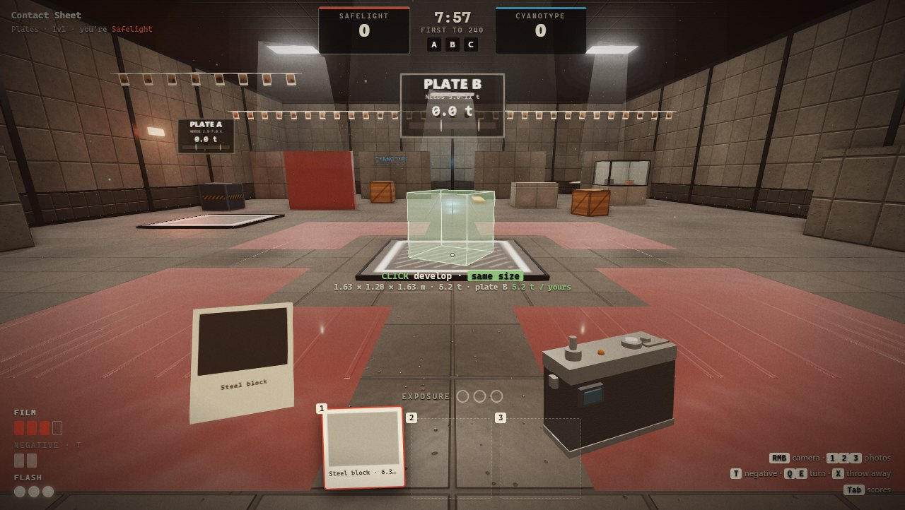
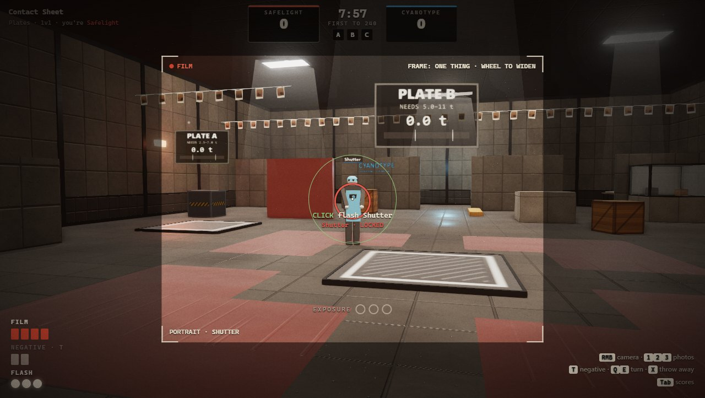
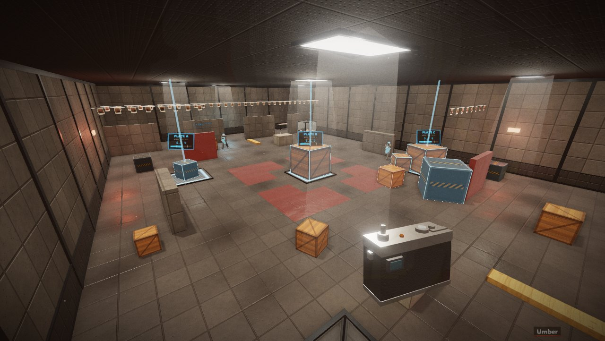
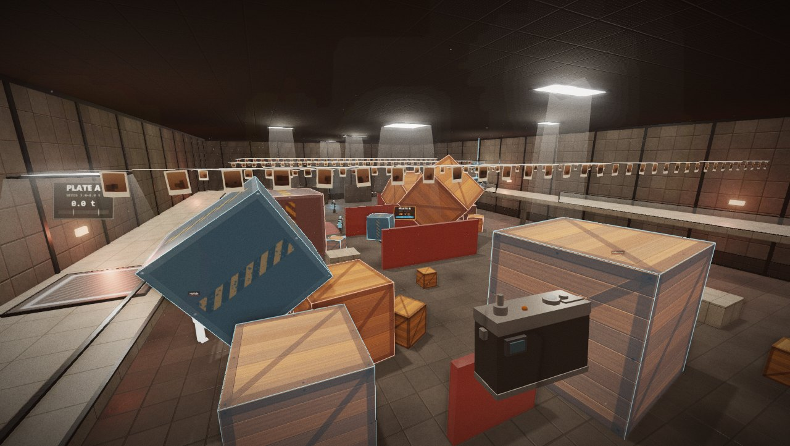

<p align="center">
  
</p>

<p align="center">
  
  
  
</p>

# Lightleak PvP

A team spin-off of [Lightleak](https://github.com/jonahsaunders/lightleak). Same camera: photograph something and it goes onto your roll; develop it somewhere else and it comes out **at the size it looked in the picture**. Now there are two crews of prints in the archive, one camera each, and not enough plates to go round.

It's a puzzle game you play against people. Every fight is about distance and weight: how far away you were when you took the photo, how far away you are when you develop it, and whose weight is sitting on the plate.

<p align="center">
  <a href="#quick-start"><b>Quick start</b></a> &nbsp;·&nbsp;
  <a href="#playing-together"><b>Play with friends</b></a> &nbsp;·&nbsp;
  <a href="#controls"><b>Controls</b></a> &nbsp;·&nbsp;
  <a href="#for-developers"><b>For developers</b></a>
</p>

## Quick start

You need [Node.js](https://nodejs.org/) 18 or later.

```bash
git clone https://github.com/jonahsaunders/lightleakpvp.git
cd lightleakpvp
npm install
npm run desktop
```

That opens the desktop app. Pick **Practice** to play against bots straight away. If you'd rather use a browser, run `npm start` instead and open http://127.0.0.1:5190.

## How it plays

<table>
  <tr>
    <td width="50%"></td>
    <td width="50%"></td>
  </tr>
  <tr>
    <td><b>Hold the plates with your own weight.</b> A plate counts only while its load is inside its range, and it belongs to the team whose <i>developed</i> weight on it is heaviest. Each held plate scores a point a second. Push theirs over the limit, or dissolve their weight with a negative, and it's nobody's. The ghost tells you the weight and whose plate it'll be before you click.</td>
    <td><b>Take their portrait.</b> Hold someone in the round focus box until it locks, then click: your flash leaves a mark of exposure. Three marks and their print is ruined. They see it coming: the edges of their screen go red, arrows point at you, and your lens glows. Anything solid stops a flash (develop a wall and you're safe); glass doesn't.</td>
  </tr>
  <tr>
    <td width="50%"></td>
    <td width="50%"></td>
  </tr>
  <tr>
    <td><b>Drop things on people.</b> Develop a photo against the ceiling and it falls. Something heavy landing on someone hurts them by its weight times its speed, so a steel block photographed from across the room and developed right above them is a knockout. <b>Take the floor away.</b> Red emulsion dissolves under a negative, and some floors are emulsion with nothing underneath.</td>
    <td><b>Everything you make stays.</b> Developed things carry your team's outline and stay put until someone dissolves them, so the arena fills up with walls, stairs and cover as a match goes on. Everyone keeps five at a time; a sixth dissolves your oldest.</td>
  </tr>
</table>

- **Modes.** *Plates*: hold plates to score, first to the limit (or ahead at the whistle) wins; you develop again five seconds after being knocked out. *Last Light*: no second prints; knock out the other team to win a round, first to three. If time runs out, the team holding more plates takes the round.
- **Teams.** 1v1, 2v2 and 5v5, on three arenas: **Contact Sheet** (small), **Drying Hall** (balconies, each team's own plate upstairs) and **Enlarger Floor** (five plates, an island over a pit, under the Curator's switched-off enlarger). Arenas are mirror images, so neither side has the better end.
- **Bots** fill any empty places, at Easy, Normal or Hard. They play the real game: they work out which object to photograph from how far away so that it develops at the right weight, where to stand to develop it, when to dissolve your weight off a plate, when to throw up cover, and when to drop something on you.
- **Film comes back.** Film, negatives and flash bulbs refill on their own; you carry three photos.

## Playing together

**Practice** runs entirely in the window: you and bots, no network.

**Online** needs one computer to run a server; everyone else connects to it.

- In the **desktop app**, press *Host a game on this network* on the Online tab. Friends on the same network connect to the address it shows (port 5190), from their own copy of the app **or from any browser** at `http://<that address>:5190`: the server hands out the game too.
- From the **source**: `npm run server` does the same thing without the app.
- **Over the internet**, run `npm run server` on a machine people can reach (a small cloud server, or your own with port 5190 forwarded) and share its address.

In the lobby: **Quick match** joins a room that's waiting (or opens one), or make a room and choose the team size, mode, arena and bots. The host starts the match; empty places are filled by bots unless the host turns that off.

## Controls

| Keyboard and mouse | Gamepad | |
| --- | --- | --- |
| <kbd>W</kbd><kbd>A</kbd><kbd>S</kbd><kbd>D</kbd>, <kbd>Space</kbd> | Left stick, A | Move, jump |
| Hold <kbd>RMB</kbd> (or <kbd>F</kbd>), click | LT, RT | Raise the camera; take a photo, or flash whoever's locked |
| <kbd>Wheel</kbd> or <kbd>G</kbd> with the camera up | Bumpers, D-pad ↑↓ | Widen or narrow the frame |
| <kbd>1</kbd><kbd>2</kbd><kbd>3</kbd> or <kbd>Wheel</kbd>, click | Bumpers, RT | Hold up a photo, develop it |
| <kbd>Q</kbd><kbd>E</kbd> | D-pad ←→ | Turn the photo you're holding |
| <kbd>T</kbd> · <kbd>X</kbd> | X · Y | Switch between film and negative · throw a photo away |
| <kbd>Tab</kbd> · <kbd>Esc</kbd> | Back · Start | Scores · menu |

Settings (sensitivity, field of view, invert look, volumes, reduced flashing, screen shake, graphics quality) are on the title screen and the pause menu. *Reduced* camera flashes turns being flashed into a dim red pulse instead of a white-out.

---

## For developers

```bash
npm install
npm run desktop
```

| Command | What it does |
| --- | --- |
| `npm start` | Runs the server and serves the game at http://127.0.0.1:5190 (this computer only) |
| `npm run server` | The same, reachable from other computers on port 5190 (`PORT=6000` to change it) |
| `npm run desktop` | Runs the desktop app (Electron), which carries its own server |
| `npm test` | Two WebSocket clients play through the lobby, then bots play every arena at every size in both modes; each match must include photos, developing, flashes, knockouts and plates changing hands |
| `npm run smoke` | Starts the desktop app hidden, hosts on the network, plays a few seconds of practice, and quits |
| `npm run shots` | Re-renders the screenshots in this README |
| `npm run web` | Builds a static web version into `build/web` and `build/lightleakpvp-web.zip` (practice works anywhere; online needs a server's address) |
| `npm run dist` | Builds the Windows installer and portable `.exe` into `dist/` (`dist:mac` on a Mac) |

If npm holds back Electron's install script, run `node node_modules/electron/install.js` once.

<details>
<summary><b>How the multiplayer works</b></summary>

- **One simulation, two places.** Everything in `shared/` is plain JavaScript with no DOM: the arena (Rapier physics), the camera rules, the match, the bots and the lobby. The server runs it in Node for online games; practice runs the very same lobby inside the page.
- **The server decides.** Photos, developing, dissolving, flashes, plates, damage, scoring and rounds all happen on the server, which runs at a fixed 60 Hz and sends each player a snapshot 30 times a second: where everyone is, anything that moved, the plates, and that player's own film, bulbs, exposure and focus.
- **You move straight away.** Your own movement runs in your browser (the same character controller), so it never lags. The server re-runs each move through its controller and sends you back if you went through a wall or faster than anyone can run.
- **Everyone else is shown a tenth of a second in the past**, smoothly interpolated between snapshots. Your browser keeps its own copy of the arena, with objects moved to where the server says they are, for walking, for the ghost of the photo you're holding, and for what your viewfinder can see.
- **Focus is the server's.** Whether your flash is locked is worked out on the server from where you're looking, and shown to you; the focus box is generous enough that a normal ping doesn't matter.
- **Leaving** hands your place to a bot, so teams stay even.

</details>

<details>
<summary><b>How the camera rules work</b> (as in Lightleak)</summary>

- **Scale.** A photo stores its objects, their arrangement and their distance from your eye (`d0`). Developing scales everything by `k = d / d0`, where `d` is the distance to where it lands, so it keeps its apparent size. Near a clean ratio (1, ½, 2, 3…) it snaps to it. Here a developed photo stays between 0.15 m and 6 m overall.
- **Composition.** A widened frame takes everything inside it that the camera can see, keeping its arrangement relative to you. Glass is transparent to it; walls and emulsion aren't.
- **Negatives.** A negative develops as a hole: every object it touches, and any emulsion, dissolves whole. Dissolved emulsion sets again after 25 seconds; an arena's own crates and blocks come back 15 seconds after they're gone.
- **Plates** count everything resting on them, stacked or not, and track how much of it each team developed. A change of hands has to hold for 0.4 s, so settling objects don't make a plate flicker.
- **Damage.** A flash is one mark (after 0.55 s of focus, at most one every 0.8 s, from up to 26 m). A falling object's momentum in tonne-metres per second decides its marks: 1.2 for one, 5 for two, 10 for all three. Marks fade one at a time once you've kept out of trouble for four seconds. Falling out of the arena is a knockout, credited to whoever last hurt you or dissolved the floor under you.

</details>

<details>
<summary><b>Making arenas</b></summary>

Arenas are JSON in `maps/`, listed in `maps/index.json`. You author one team's half; the loader mirrors it with a half-turn about the centre (`x, z` → `-x, -z`) for the other team, so arenas are always fair. Anything with `"mid": true` sits on the centre line and isn't copied.

- `room`: `x0 x1 z0 z1 h`; `"floor": false` if you build the floor yourself out of blocks (for pits).
- `blocks`: `min`, `max`, `mat` (`floor`, `wall`, `ledge`, `dark`, `glass`, `emulsion`), optional `cast` for shadows.
- `props`: `type` (`crate`, `steel`, `plank`), `pos` (bottom centre), `size`, `rot`.
- `plates`: `pos`, `size` `[w, d]`, `need`, `max`. They're lettered left to right automatically.
- `spawns` (team 0's), `lights` (`panel` for ceiling panels), `decor` (`bench`, `line`, `safelight`, `sign`, `enlarger`), `score` (the Plates limit), `sizes` (which team sizes it's meant for), `blurb`.

Bots find their own way around: a walking grid is built from the geometry when a match starts, and knows which floors and walls are emulsion. Run `node test/run.mjs map=<id>` to watch bots play a new arena at every size.

</details>

<details>
<summary><b>Project layout</b></summary>

| Path | What's there |
| --- | --- |
| `shared/config.js`, `shared/math.js` | Tuning; vectors and quaternions on plain arrays |
| `shared/arena.js`, `shared/mapdef.js`, `shared/move.js` | The physical arena; mirroring arenas; walking |
| `shared/camera.js` | Framing, photos, where a photo would develop, negatives, the flash's focus box |
| `shared/match.js` | A match: players, actions, damage, plates, scoring, rounds, snapshots |
| `shared/bots.js`, `shared/nav.js` | Bot brains; the walking grid and A* |
| `shared/lobby.js` | Rooms, teams, quick match, starting matches |
| `server.js` | The HTTP and WebSocket server |
| `js/main.js`, `js/menu.js`, `js/net.js` | Boot, input and the loop; the title screen and lobby; WebSocket and in-page connections |
| `js/game.js` | A match as the page sees it: your movement, interpolation, events, your photos |
| `js/view.js`, `js/avatar.js`, `js/hud.js` | The arena's look; other players; everything drawn over the view |
| `js/materials.js`, `js/post.js`, `js/audio.js`, `js/fx.js`, `js/dressing.js`, `js/viewmodel.js` | From Lightleak: procedural textures, post-processing, synthesised sound, effects, trim, the camera in your hands |
| `desktop/`, `tools/`, `test/` | The Electron app and its screenshot staging; the icon and web build; the headless tests |

</details>

<details>
<summary><b>Known gaps</b></summary>

- **It needs playing by people.** Balance (flash timing, crush thresholds, film refill, score limits) was tuned by watching bots play hundreds of matches, not humans. The numbers are all in `shared/config.js`.
- **Trust.** Movement is reported by each player's own browser and checked, not simulated, by the server. That's fine among friends; a public server would want more.
- **No lag compensation.** Flashes are judged where people are on the server, not where you saw them; the generous focus box covers ordinary pings, not bad ones.
- **Finding each other.** There's no central server or matchmaking: someone hosts, and over the internet that means a reachable machine or a forwarded port.
- The ghost checks "someone's standing there" against other players where your screen shows them, a tenth of a second behind the server, so now and then a develop the ghost allowed is refused.

</details>

## Originality

Like Lightleak, this is written from scratch. It borrows Lightleak's own code (materials, sound, effects, the camera in your hands) and its rules, and nothing from Valve's cancelled camera prototype or the Portal series. The team colours are a darkroom safelight red and a cyanotype blue, and the players are prints.

Textures are painted in code, sounds are synthesised, and the icon is generated by `tools/icon.js`. Third-party code (three.js, Rapier and ws) is listed in [LICENSES.md](LICENSES.md).
